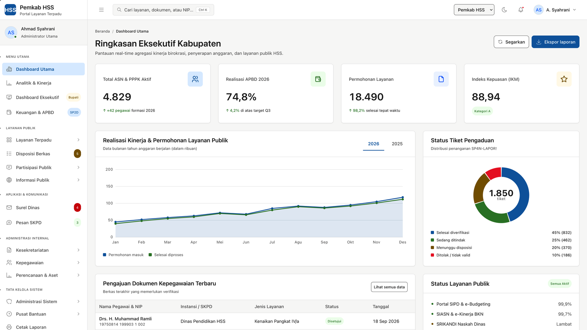

<p align="center">
  
</p>

<h1 align="center">inagov-template · idds-ui-pack</h1>

<p align="center">
  <strong>67 template antarmuka aplikasi pemerintah daerah (SPBE / e-government) berbasis INA Digital Design System.</strong><br>
  HTML murni · tanpa build · tanpa CDN · token resmi <code>@idds/styles</code> · mode terang &amp; gelap · siap dipakai skill VCBD.
</p>

<p align="center">
  <a href="https://github.com/Syamsuddin/inagov-template/releases/latest"></a>
  <a href="LICENSE"></a>
  
  
  
  
</p>

---

## Mengapa paket ini

Membangun aplikasi pemda biasanya dimulai dari nol: tiap OPD punya tampilan sendiri, warna sendiri, dan komponen yang tidak konsisten. **idds-ui-pack** memberi titik awal yang sudah **mengikuti desain sistem nasional INAgov (IDDS)** — desain yang sama dengan portal layanan pemerintah pusat — sehingga aplikasi daerah langsung terasa satu keluarga dengan aplikasi umum SPBE (SRIKANDI, SIPD, SIASN, SP4N-LAPOR!).

- **Cakupan proses bisnis pemda yang nyata.** Bukan sekadar dashboard generik: ada standar pelayanan 6 komponen (Permenpan 15/2014), SKM 9 unsur (Permenpan 14/2017), disposisi berjenjang dengan TTE BSrE, pohon kinerja (Permenpan 89/2021), DIP PPID (UU 14/2008), JDIH, Satu Data (Perpres 39/2019), BMD per KIB, monev fisik–keuangan, sampai persetujuan privasi UU 27/2022.
- **Buka langsung di peramban.** Tidak ada npm, bundler, atau framework. Salin folder, buka `index.html`, selesai. Cocok untuk demo ke pimpinan, prototipe cepat, maupun basis kode produksi (PHP native, Laravel, atau apa pun).
- **Satu sumber kebenaran visual.** Semua warna, jarak, radius, tipografi lewat token `@idds/styles` — tidak ada nilai hex/px liar. Ganti brand instansi dengan satu perintah; kontras tiap pasangan warna diuji otomatis untuk tema terang **dan** gelap.
- **Terverifikasi, bukan dijanjikan.** `docs/scripts/verify.sh` memeriksa keutuhan paket, kontras token, dan kepatuhan kode terhadap konvensi (tanpa warna literal, tanpa token primitif, tanpa `outline:none`, satu primary button per layar, dll.).

## Mulai dalam 30 detik

```bash
git clone https://github.com/Syamsuddin/inagov-template.git
cd inagov-template
open index.html          # macOS · Windows: start index.html · Linux: xdg-open index.html
```

Untuk memasang ke proyek aplikasi (dengan atau tanpa skill VCBD Claude Code):

```bash
cp -r inagov-template /path/proyek/.idds
bash /path/proyek/.idds/docs/install.sh        # --native untuk PHP tanpa framework
bash /path/proyek/.idds/docs/scripts/verify.sh # uji keutuhan + kepatuhan token
```

Satu hal yang gampang terlewat: brand tidak aktif tanpa atribut di `<html>`:

```html
<html lang="id" data-theme="light" data-brand="hss">
```

Panduan lengkap (prompt VCBD, urutan langkah, slot `[ISI:]` yang wajib diisi) ada di [`docs/INSTALL.md`](docs/INSTALL.md); konvensi UI di [`docs/26_UI_CONVENTIONS.md`](docs/26_UI_CONVENTIONS.md); rincian teknis paket di [`docs/README.md`](docs/README.md).

## Apa saja di dalamnya — 67 laman

Setiap laman admin memakai kerangka yang identik (sidebar berjenjang, topbar dengan pencarian `Ctrl+K`, pemilih brand, mode gelap, notifikasi, menu pengguna, footer) dan datanya berupa contoh fiktif Kabupaten Hulu Sungai Selatan.

| Kelompok | Laman | Yang bisa dicoba |
|---|---|---|
| **Dasar** | `index`, `dashboard-analytics`, `keuangan`, `tables`, `cards`, `forms`, `components`, `chat`, `mail`, `profile`, `katalog-artikel`, `artikel` | KPI, chart kanvas (line/bar/donut) yang ikut berubah saat tema/brand diganti, tabel sort/filter/bulk, wizard, dropzone, 5 status validasi, obrolan & pembaca surel 3 panel |
| **Autentikasi & akun** | `login`, `register`, `forgot-password`, `otp`, `lock-screen`, `pilih-unit`, `verifikasi-identitas`, `persetujuan-privasi`, `onboarding` | SSO ASN Digital / INApas, meter kekuatan sandi, OTP auto-maju, pilih peran multi-OPD, KTP + swafoto, consent per tujuan UU PDP, wizard 5 langkah penyiapan instansi |
| **Layanan publik** | `layanan`, `layanan-detail`, `permohonan`, `lacak`, `antrian`, `pengaduan`, `pengaduan-detail`, `skm`, `skm-hasil` | katalog + chip filter, 6 komponen standar pelayanan, permohonan 4 langkah dengan bukti terima, pelacakan + unggah perbaikan, reservasi slot + papan loket, aduan terhubung SP4N-LAPOR! dengan SLA, Likert 9 unsur + IKM |
| **Keterbukaan informasi** | `portal`, `ppid`, `jdih`, `jdih-detail`, `data`, `dataset` | beranda portal, DIP 4 kategori + permohonan/keberatan, produk hukum + metadata JDIHN, katalog dataset SDI + API + kamus data |
| **Persetujuan & tata kelola** | `disposisi`, `pengguna`, `peran`, `audit`, `pengaturan`, `cetak` | persetujuan berjenjang dengan passphrase TTE, undang & ubah peran, matriks peran × izin, log audit append-only dengan diff sebelum–sesudah, 5 tab pengaturan (identitas, integrasi SPBE, notifikasi, keamanan, pemeliharaan), lembar A4 + `@media print` |
| **Administrasi internal** | `naskah`, `tte`, `agenda`, `pegawai`, `pegawai-detail`, `presensi`, `cuti`, `kinerja`, `monev`, `aset`, `dashboard-eksekutif` | TNDE + klasifikasi arsip, penandatanganan BSrE, kalender pimpinan + konflik jadwal, pohon organisasi, profil HR, matriks presensi 30 hari, kuota & persetujuan cuti, pohon kinerja + PK + realisasi, kurva S program→sub kegiatan, BMD per KIB, peta ubin kecamatan |
| **Bantuan & status** | `notifikasi`, `bantuan`, `tiket`, `kebijakan-privasi`, `404`, `403`, `500`, `maintenance` | pusat notifikasi + preferensi kanal, FAQ + panduan + status layanan, tiket helpdesk dengan SLA, dokumen privasi dengan daftar isi lengket, halaman status pola Empty State |
| **Publik & layar besar** | `publik-beranda`, `publik-layanan`, `publik-lacak`, `publik-pengaduan`, `kios-antrian`, `situation-room` | kerangka warga tanpa sidebar (header lengket, menu mobile tanpa JS, footer 4 kolom, skip link), papan antrian layar besar, situation room Bupati tema gelap |

## Kontrak desain yang dijaga

| Aspek | Ketentuan |
|---|---|
| Token | Warna, spasi, radius, tipografi, bayangan, z-index — semua dari `assets/idds-tokens.css` (kunci `@idds/styles` 1.6.36 + lapisan semantik turunan). Kode tidak boleh memanggil token primitif (`blue-500`) maupun nilai literal. |
| Brand | 8 brand siap pakai (HSS, INA Gov, PAN-RB, BKN, LAN, INApas, INAku, BGN). Brand daerah baru dibuat dari satu hex logo dengan `docs/scripts/build-brand.py` (ramp 11 langkah di ruang OKLCH). |
| Kontras | Setiap pasangan label–latar diuji WCAG 2.1 AA untuk tema terang dan gelap; hasilnya di `docs/data/aturan-kontras.json`. Latar kuning wajib teks gelap. |
| Tombol | Hierarki mengikuti npm (`primary` / `secondary` / `tertiary` / `danger`), label **Sentence case**, satu primary button per layar. |
| Ikon | Tabler Icons (MIT), inline SVG, ukuran & stroke sesuai tabel konvensi; tanpa emoji/glyph. |
| Aksesibilitas | Focus ring token pada semua elemen interaktif, `aria-*` pada kontrol, skip link di kerangka publik, `prefers-reduced-motion` dihormati. |
| Responsif | Breakpoint 1024 / 768 / 480 px; sidebar jadi laci, grid menumpuk, tabel bergulir. |

## Mengganti brand ke daerah Anda

Brand didefinisikan sebagai blok CSS terpisah (`assets/brand-hss.css`) berisi ramp 11 langkah `primary-25…950` plus pemetaan `primary-primary` untuk tema terang dan gelap, dan diaktifkan lewat `data-brand="…"` pada `<html>`. Untuk daerah lain:

1. Sampel warna utama dan aksen **dari berkas logo** (bukan dari deskripsi verbal lambang) — catatan caranya di [`docs/README.md`](docs/README.md).
2. Turunkan ramp 11 langkah di ruang OKLCH dengan profil lightness ramp brand resmi IDDS, tulis ke `assets/brand-<nama>.css` dan `docs/data/brand-<nama>.json` mengikuti pola berkas HSS. Skrip `docs/scripts/build-brand.py` yang mengotomatiskan langkah ini masih ditandai ⬜ di MANIFEST dan akan disertakan pada rilis berikutnya.
3. Jalankan `python3 docs/scripts/build-kontras.py --check` — setiap pasangan label–latar brand baru diuji AA untuk kedua tema; yang gagal ditampilkan dengan angka kontrasnya.

## Struktur repositori

```
├── *.html                 67 laman — buka langsung
├── assets/
│   ├── idds-tokens.css    token TERKUNCI + lapisan semantik, brand terpasang
│   ├── idds-utilities.css tipografi, ikon, focus ring
│   ├── idds-admin.css     tata letak + komponen (Fase 1–6), semua lewat token
│   ├── idds-admin.js      tema, brand, sidebar, modal, toast, chart, tabel, stepper, tree, …
│   └── brand-hss.css      blok brand contoh
├── docs/
│   ├── README.md          dokumen teknis paket
│   ├── INSTALL.md         langkah pasang + prompt VCBD
│   ├── 26_UI_CONVENTIONS.md konvensi UI (mengisi slot 26 VCBD)
│   ├── Implementation_Plan.md rencana & fase 2–6
│   ├── MANIFEST.json      rute pemuatan, SHA, status berkas, riwayat versi
│   ├── data/              aturan-kontras.json, brand-hss.json
│   └── scripts/           build-kontras.py, verify.sh, install.sh
├── CHANGELOG.md · VERSION · LICENSE
```

## Peta jalan

- [x] Fase 1–6: 67 laman lintas layanan publik, keterbukaan, administrasi internal, akun, bantuan, publik, layar besar
- [ ] GeoJSON batas kecamatan untuk peta (kelas `.ina-tile-1..5` siap dipakai ulang pada `<path>`)
- [ ] Mode kios yang mengunci tema dari sisi server
- [ ] Contoh integrasi ke Laravel Blade dan PHP native (partial header/sidebar/footer)
- [ ] Sprite Tabler kustom & font Inter lokal (berkas ⬜ di MANIFEST)

Kontribusi dipersilakan — buka *issue* untuk laman/komponen yang belum ada atau kirim *pull request* yang lolos `verify.sh`.

## Klasifikasi, lisensi, dan kredit

- Dokumen sumber IDDS (PDF) dan dosir analisisnya berklasifikasi internal, **tidak disertakan**, dan diblokir `.gitignore`. Yang dipublikasikan hanya turunan dari paket npm publik `@idds/styles` dan `@idds/react`.
- Kode dan template: **MIT** (`LICENSE`). Ikon: Tabler Icons (MIT). Font: Inter (SIL OFL). Desain sistem: INA Digital Design System — INA Digital / GovTech Indonesia.
- Seluruh data pada template (nama, NIP, nomor telepon, surel, angka) adalah **contoh fiktif**; kemiripan dengan pihak nyata tidak disengaja.

<p align="center"><sub>Dibuat untuk mempercepat digitalisasi pemerintah daerah — dari Hulu Sungai Selatan, Kalimantan Selatan.</sub></p>
